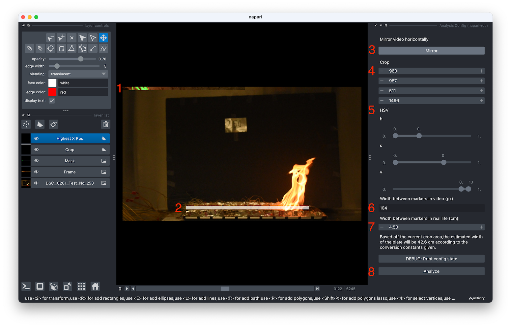

# napari-ros Manual

For napari-ros version v1.0.0

## Installation (Windows)

### 1. Install miniconda

Install miniconda (if not installed already, or have anaconda installed): https://docs.conda.io/projects/conda/en/latest/user-guide/install/windows.html#installing-on-windows. Please follow the steps under "Installing on Windows".

### 2. Install napari

Follow the Python install steps (using conda, under "For those familiar with Python:") at https://napari.org/stable/tutorials/fundamentals/quick_start.html#installation. Note this requires using the Anaconda Prompt.

### 3. Install napari-ros plugin

In the same Anaconda Prompt window as the above step, make sure the conda environment "napari-env" is activated (it should say it on the left hand side in the Anaconda Prompt window). Then run

```sh
python -m pip install <path to tar.gz napari-ros file>
```

For example,

```sh
python -m pip install C:\Users\kyle\Desktop\napari-ros-1.0.0.tar.gz
```

### 4. Make sure everything installed correctly

In the same Anaconda Prompt window as the above step, run the command:

```sh
napari
```

The napari window should open. In the "Plugins" menu, there should be a button called "Analysis Config (napari-ros)". If you see that button, the install went OK.

## Steps for Analyzing a Single Test

### 1. Preparing the Anaconda Prompt

Open the Anaconda Prompt window and activate the conda environment "napari-env".

```sh
conda activate napari-env
```

Next, in the Anaconda Prompt, `cd` to the directory on where the image sequences are.

With both steps done above, the prompt should look something like:

```sh
(napari-env) C:\Users\kyle\Box\ROS_Experiments_Data_Folder\ImageSequences>
```

Where running the `dir` command should list the folders containing the image sequence of each video.

### 2. Loading an Image Sequence

In the same Anaconda Prompt window as before, run the command:

```sh
napari DSC_0218_Test_No_263 -w napari-ros "Analysis Config"
```

This will open up the napari application and load the napari-ros plugin, with the image sequence contained in the "DSC_0218_Test_No_263" folder. Wait a few seconds until all the overlays on top of the video show up.

### 3. Adjusting Parameters

Parameter adjustments can be made on the left hand side. Use the seek bar at the bottom of the window to skip through the video.

_Note that pressing the play button next to the seek bar is really slow and is not recommended._

#### Interface



1. This is results of the detection algorithm. The green highlight shows what the algorithm detects as fire, and the red line is the detected flame leading edge.
2. This white box shows the crop area.
3. Mirror the video in the analysis. Used when the flame is ignited from the right and moves towards the left.
4. The crop area. The numbers represent top, bottom, left, then right respectively.
5. These are the HSV thresholds. **It is recommended to make small adjustments**.
6. Enter the amount of pixels between two markers in the video. In the layer list, click on the "DSC_0...". Now, hovering with your mouse over the video will show the coordinates in the bottom left of the window. Use this to calculate the width between two markers. The text box accepts math expressions, e.g. entering 1000-100 and hitting enter automatically enters the value 900.
7. Enter the width in cm between the markers in real life. Below shows an approximate calculation of how long the plate is based on the cropping area.
8. When the parameters are finalized, hit "Analyze". This will create a new folder next to the image sequence folders called "data".

Parameters settings are saved when clicking the "Analyze" button. They will be loaded next time a test is loaded, as long as you ran the `napari` command in the same place.

### 4. Post-Processing

When the parameters are finalized, hit "Analyze". This will create a new folder next to the image sequence folders called "data".

Post processing will be done automatically and results will be placed in that "data" folder.

The post processing successfully completes when the "Analyzing..." window says "done".

Analysis is done! From there the napari windows can safely be closed.

To run another test, start from step 2. Pick a different folder in the same directory of image sequence folders. The napari-ros plugin automatically loads the last parameters used (only if the next image sequence folder is right next to the previous one).
